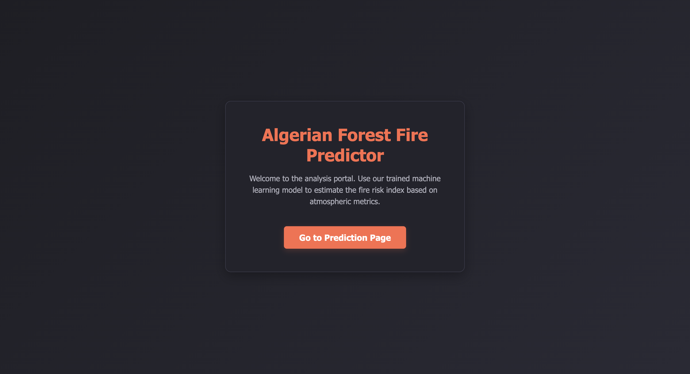
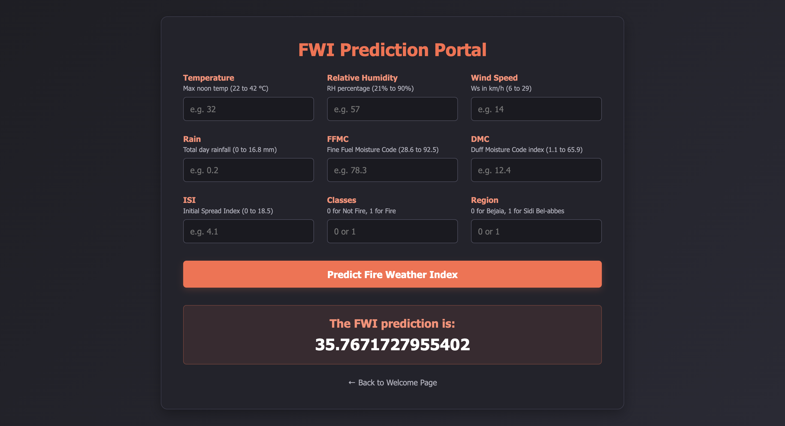

# 📊 Algerian Forest Fire FWI Prediction End-to-End ML Project

This repository features a production-ready, end-to-end Machine Learning pipeline engineered to predict the occurrence and intensity of forest fires based on meteorological observations. Utilizing robust regression and classification modeling, the system dynamically analyzes weather factors such as temperature, relative humidity, wind speed, and rainfall to provide accurate predictive insights. 
The entire application is containerized and deployed into production with automated pipelines.

---

## 🔗 Live Application Link

You can interact with the live web application here:  
🚀 **[Fire Weather Index (FWI) Predictor on AWS Elastic Beanstalk](http://practiceforestfire-env.eba-2jrwrfnd.eu-north-1.elasticbeanstalk.com/)**

---

## 📱 Application Preview

Below is a live preview of the web interface. Visitors can input meteorological features—such as temperature, relative humidity, wind speed, and rainfall—along with FWI components to generate immediate forest fire danger and prediction model insights.

### Home Interface


### Prediction Interface


---

## 🛠️ Architecture & Tech Stack

This project is built using modern production-grade DevOps and ML methodologies:

* **Machine Learning Frameworks & Libraries**: `Python`, `Scikit-Learn`, `Pandas`, `NumPy` (utilizing optimized regression algorithms like Ridge Regression and robust StandardScaler scaling)
* **Web Framework**: `Flask` (Configured to securely handle interface inputs and serve model predictions)
* **Cloud Hosting**: `AWS Elastic Beanstalk` (Running on a highly stable Docker Linux Platform to handle web traffic scaling)
* **CI/CD Automation**: `AWS CodePipeline` (Configured to listen directly to your GitHub main branch for automated building, testing, and zero-downtime deployment)
---

## 📂 Project Directory Structure

```text
├── dataset/                  # Raw and processed dataset files
│   └── Algerian_forest_fires_cleaned_dataset.csv
├── models/                   # Serialized model artifacts (Pickle files)
│   ├── linearReg.pkl
│   ├── ridge.pkl
│   └── scaler.pkl
├── notebooks/                # Jupyter notebooks for experimentation
│   ├── 1.0-EDA And FE Algerian Forest Fires.ipynb
│   └── 2.0-Model Training.ipynb
├── Screenshots/                      
│   ├── home.png
│   └── index.html           
├── templates/                # HTML templates for the Flask web application
│   ├── index.html
│   └── home.html
├── app.py                    # Flask application entry point
├── requirements.txt          # Project dependencies and libraries
└── README.md                 # Project documentation
```

---

# lab-flask

<!--  -->


To run flask application 

```
python app.py
```

To access your flask application open new tab in and paste the url:
```
localhost:5000/
```

---

## 🎯 Problem Statement & Key Insights

### Problem Statement
Forest fires represent a severe threat to biodiversity, human lives, and infrastructure across the Mediterranean basin, including the Bejaia and Sidi Bel-abbes regions of Algeria. Proactive wildfire management requires an accurate and reliable method to gauge fire potential before ignition occurs. 

The objective of this project is to build an end-to-end machine learning regression pipeline to predict the **Fire Weather Index (FWI)**—a critical metric that quantifies fire intensity and danger levels based on real-time weather conditions and fuel moisture indices. By automating FWI estimation and deploying it as a cloud-hosted API service, local authorities and environmental agencies can anticipate extreme fire behaviors, optimize resource allocation, and implement preemptive safety protocols.

### Key Insights from Exploratory Data Analysis (EDA)
* **High Seasonality**: Wildfire incidents are highly seasonal and concentrated within specific summer months. The highest frequency of forest fires occurs during June, July, and August, peaking significantly in **August**. Conversely, fire occurrences drastically decline as temperatures drop in September.
* **Geographic Distribution**: The dataset encompasses a balanced representation of two major Algerian regions: the northeast (**Bejaia**) and the northwest (**Sidi Bel-abbes**), each containing 122 historical observations.
* **Critical Fire Indicators**: High temperatures ($>30^\circ\text{C}$), low relative humidity ($\text{RH}$), and low rainfall are strongly correlated with elevated **Fine Fuel Moisture Code (FFMC)** and **Initial Spread Index (ISI)** values, which directly amplify the final **Fire Weather Index (FWI)** score.
